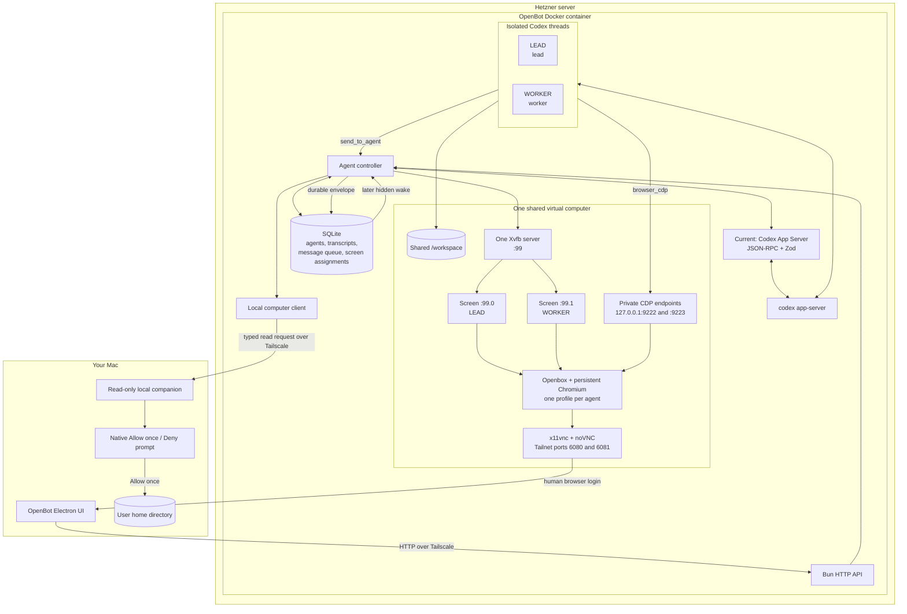

# OpenBot architecture

## Implemented

- Stable `lead` and `worker` IDs with separate runtime sessions and transcripts.
- SQLite-backed message envelopes, delivery state, transcript events, and X11 screen assignments.
- Fire-and-forget peer messaging through `send_to_agent`; replies arrive later as new durable messages.
- Skills and CLI tools exposed by the current Codex runtime.
- One shared Linux computer with two X11 screens, a shared workspace, and one persistent Chromium profile per agent.
- Private CDP browser control and Electron live-screen preview with user input forwarding.
- Approval-gated read-only access to the user's Mac through a separate local companion.
- React, Vite, and Tailwind Electron renderer. Chat bubbles are content-sized and Markdown is safely rendered by a small local renderer.

## Runtime boundary

OpenBot owns identity, persistence, messaging, agent scheduling, browser control, and permission boundaries. The runtime owns model turns and generic coding tools. This separation is deliberate: changing model providers cannot discard queued work or weaken host-side permissions.

## Next: Pi runtime

Replace the current Codex App Server client with an in-process Pi SDK adapter. Pi will handle model sessions, provider authentication, and generic shell/file tooling. The existing host will continue to execute OpenBot-specific tools: `send_to_agent`, `browser_cdp`, `local_read_file`, and `local_list_directory`.

The Pi migration has been researched and documented, but is not implemented in this commit. Priority interruption, bounded meetings, and scoped memory are future host layers.
