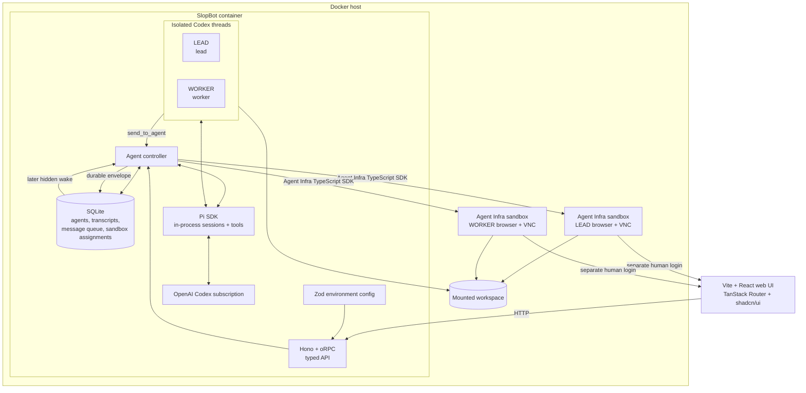

# SlopBot architecture

## Implemented

- Stable `lead` and `worker` IDs with separate runtime sessions and transcripts.
- SQLite-backed message envelopes, delivery state, transcript events, and sandbox assignments.
- Fire-and-forget peer messaging through `send_to_agent`; replies arrive later as new durable messages.
- Skills and coding tools exposed by Pi.
- One Agent Infra browser sandbox per agent with a shared mounted workspace.
- SDK-backed browser navigation, selectors, page text, evaluation, screenshots, and user input.
- React, Vite, Tailwind, shadcn/ui, and TanStack Router web UI.
- Hono-hosted oRPC calls share the server router type directly with the web client.
- Environment variables are parsed once through the Zod schema in `packages/config`.

## Runtime boundary

SlopBot owns identity, persistence, messaging, agent scheduling, browser control, and permission boundaries. The runtime owns model turns and generic coding tools. This separation is deliberate: changing model providers cannot discard queued work or weaken host-side permissions.

## Runtime

Pi runs in-process and owns model sessions, ChatGPT subscription authentication, skill discovery, and generic shell/file tooling. SlopBot executes `send_to_agent` locally and routes the validated `browser` tool through the Agent Infra SDK.
