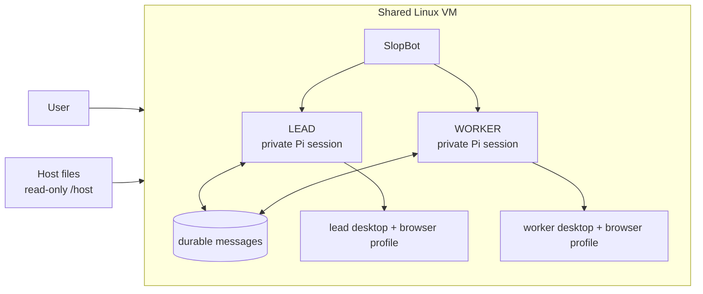

# SlopBot

SlopBot is a small app for running persistent AI bots that can use a computer and talk to each other.

Each bot has its own identity, instructions, private conversation, and Pi session. Bots coordinate through durable messages, keeping every handoff deliberate and visible. The default team has a `lead` bot that coordinates work and a `worker` bot that executes it; more bots can be added from the UI.



## Principles

- Keep bots persistent: identities, conversations, and messages survive restarts.
- Keep conversations private: bots share only deliberate handoffs.
- Keep coordination user-directed: bots message each other only when the user explicitly asks, and those requests and results appear in each bot's chat.
- Keep the user in control: active work can be redirected or stopped at any time.
- Keep work contained: the runtime, credentials, skills, state, and bot workspace stay inside the Linux VM.
- Keep the product small: bots, messages, one computer, and a clear interface.

## Install

On macOS or Linux:

```sh
curl -fsSL https://raw.githubusercontent.com/simonbalfe/slopbot/main/install.sh | sh
slopbot
```

The installer downloads SlopBot and installs missing runtime dependencies into user-owned directories, including Bun and a pinned Lima release. It detects the operating system and CPU architecture and does not require Homebrew or Git. On Linux, it installs QEMU through the available system package manager when QEMU is missing. Existing installation directories are preserved.

Open the web interface at <http://127.0.0.1:4317>. The first run asks you to connect a ChatGPT Plus or Pro account.

## How the computer works

Lima runs SlopBot inside a lightweight Debian virtual machine using the host's supported virtualization system. The SlopBot server, Pi runtime, model authentication, configuration, skills, SQLite database, sessions, and working files all live on the VM disk. Every bot uses that computer and keeps a separate persistent desktop and Chromium profile inside it. SlopBot sizes the VM up to 6 CPUs and 8 GiB of memory based on the host's available hardware.

The bot workspace is `/home/slopbot/workspace`. Host files are available read-only at `/host`; set `SLOPBOT_HOST_PATH` before installation to choose the exposed host directory. The dashboard is forwarded to <http://127.0.0.1:4317> and each bot's desktop is available through its dashboard link.

The repository's Docker packaging remains available for server development. The supported local installation uses Lima on macOS and Linux.

## Development

```sh
bun install
bun run dev
bun run check
bun apps/server/src/verify.ts
```

See [the computer interface](docs/computer-api.md) for integration details and [the roadmap](docs/roadmap.md) for planned work.
