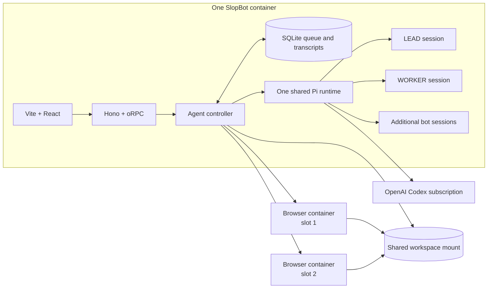

# SlopBot

SlopBot is a minimal two-agent web app. LEAD coordinates work, WORKER executes it, and every handoff is a durable message rather than shared chat context.

## Architecture



Pi agents are sessions inside the shared SlopBot process, not containers. The two browser containers are optional assignable work surfaces with separate login profiles.

See [docs/roadmap.md](docs/roadmap.md) for the blueprint gap analysis and build order.

```sh
bun install
bun run install:leads
bun run dev
```

The development command starts the Docker runtime, then Vite serves the UI at `http://127.0.0.1:5175` and proxies typed oRPC calls to Hono at `http://127.0.0.1:4317`.

```sh
bun start
```

`bun start` builds the production web app and serves it from Bun.

## Current status

- Web UI built with React, Vite, Tailwind, and TanStack Router.
- End-to-end typed oRPC API hosted by Hono.
- Stable `lead` and `worker` defaults, with additional bots managed in Settings.
- Separate durable transcripts and a SQLite message queue.
- Asynchronous correlated `send_to_agent` handoffs with bounded retries and visible delivery state.
- One shared SlopBot container for every Pi session, plus two assignable browser-runtime containers controlled through a small TypeScript API.
- A live browser preview with direct pointer and scroll input.
- Skills are listed in Settings and attached to a run only when selected.
- The `gmaps-leads-cli` skill is mounted from `$CODEX_HOME`, and WORKER can run its Linux `leads` binary through Pi's shell tool.

The model runtime is Pi's in-process SDK using the `openai-codex` provider and a ChatGPT Plus or Pro subscription. SlopBot owns the agent registry, SQLite queue, UI, browser API, and browser image. [Agent Infra Sandbox](https://github.com/agent-infra/sandbox) remains a parity reference only.

The core package exports the Pi runtime and SlopBot orchestration layers separately:

```ts
import { AgentController, PiRuntime } from "slopbot";

const cwd = process.cwd();
const runtime = new PiRuntime({ cwd });
const agents = new AgentController(runtime, {
  cwd,
  databasePath: ".slopbot/slopbot.sqlite",
});

await agents.initialize();
agents.sendMessage("lead", "Research this, build it, then review it.");
```

Agent profiles, runtime session IDs, message envelopes, delivery states, and visible transcripts persist in SQLite.

Open `http://127.0.0.1:4317` for the local UI.

## Local browser sandboxes

`compose.yaml` runs the shared SlopBot app and two browser-runtime slots. Slots are assigned to agents when available. Both mount the selected workspace, while separate Docker volumes preserve each browser login across container rebuilds. The runtime is implemented in TypeScript under [`packages/browser-runtime`](packages/browser-runtime/README.md).

```sh
docker compose up -d --build
```

SlopBot prompts for ChatGPT Plus/Pro authentication before showing the agents. The OAuth tokens are stored under the existing `data` volume and refreshed by Pi.

Open `http://127.0.0.1:4317`. Use each agent's **Open login** link, or open `http://127.0.0.1:6080/vnc/vnc.html` for LEAD and port `6081` for WORKER.

For a cloud host, keep the browser and raw CDP ports private, set `SLOPBOT_SANDBOX_PUBLIC_URLS` to authenticated browser URLs, and provide `SLOPBOT_SANDBOX_API_KEY` through the platform's secret store. Never expose raw CDP directly to the internet.

Set `SLOPBOT_WORKSPACE_PATH` to the Mac folder the agents should use. Docker mounts only that folder at `/workspace`.

`bun run install:leads` builds the current CLI source from `$REPOS_ROOT/projects/clients/david/gmaps-leads-cli` into the ignored local data directory. Set `LEADS_API_URL` in your shell before starting SlopBot; provider credentials stay on the Leads API server.

## Repository layout

- `apps/server`: Hono, oRPC, and the production static UI host.
- `apps/web`: React, Vite, Tailwind, and TanStack Router.
- `apps/server/src/config.ts`: Zod-validated server environment configuration.
- `packages/core`: Pi runtime adapter, orchestration, persistence, and computer tools.
