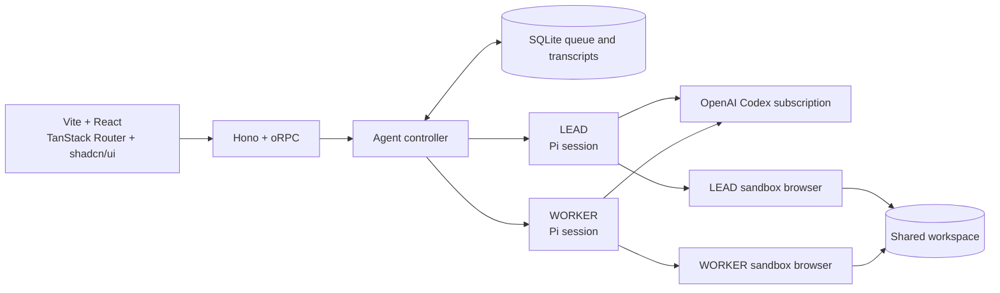

# SlopBot

SlopBot is a minimal two-agent web app. LEAD coordinates work, WORKER executes it, and every handoff is a durable message rather than shared chat context.

## Architecture



See [ARCHITECTURE.md](ARCHITECTURE.md) for the runtime diagram and [docs/roadmap.md](docs/roadmap.md) for the blueprint gap analysis and build order.

```sh
bun install
bun run dev
```

The development command starts the Docker runtime, then Vite serves the UI at `http://127.0.0.1:5175` and proxies typed oRPC calls to Hono at `http://127.0.0.1:4317`.

```sh
bun start
```

`bun start` builds the production web app and serves it from Bun.

## Current status

- Web UI built with React, Vite, Tailwind, shadcn/ui, and TanStack Router.
- End-to-end typed oRPC API hosted by Hono.
- Two stable agents: `lead` and `worker`.
- Separate durable transcripts and a SQLite message queue.
- Asynchronous `send_to_agent` handoffs with visible sender and recipient records.
- One Agent Infra browser sandbox per agent, controlled through its typed SDK.
- A live browser preview with direct pointer and scroll input.
- Skills are listed in Settings and attached to a run only when selected.

The model runtime is Pi's in-process SDK using the `openai-codex` provider and a ChatGPT Plus or Pro subscription. SlopBot owns the agent registry, SQLite queue, and UI. [Agent Infra Sandbox](https://github.com/agent-infra/sandbox) owns the isolated browser environments.

The core package exports the Pi runtime and SlopBot orchestration layers separately:

```ts
import { AgentController, PiRuntime } from "slopbot";

const cwd = process.cwd();
const runtime = new PiRuntime({ cwd });
const agents = new AgentController(runtime, {
  cwd,
  databasePath: ".slopbot/slopbot.sqlite",
});

await agents.initialize();
agents.sendMessage("lead", "Research this, build it, then review it.");
```

Agent profiles, runtime session IDs, message envelopes, delivery states, and visible transcripts persist in SQLite.

Open `http://127.0.0.1:4317` for the local UI.

## Local browser sandboxes

`compose.yaml` runs one browser sandbox for LEAD and one for WORKER. Both mount the selected workspace, while separate Docker volumes preserve each browser login across container rebuilds. SlopBot uses the Agent Infra SDK for navigation, page text, selectors, screenshots, and input.

```sh
docker compose up -d --build
```

SlopBot prompts for ChatGPT Plus/Pro authentication before showing the agents. The OAuth tokens are stored under the existing `data` volume and refreshed by Pi.

Open `http://127.0.0.1:4317`. Use each agent's **Open login** link, or open `http://127.0.0.1:6080/vnc/index.html?autoconnect=true` for LEAD and port `6081` for WORKER.

For a cloud host, keep the sandbox ports private, set `SLOPBOT_SANDBOX_PUBLIC_URLS` to the authenticated browser URLs, and provide `SLOPBOT_SANDBOX_API_KEY` through the platform's secret store.

Set `SLOPBOT_WORKSPACE_PATH` to the Mac folder the agents should use. Docker mounts only that folder at `/workspace`.

## Repository layout

- `apps/server`: Hono, oRPC, and the production static UI host.
- `apps/web`: React, Vite, Tailwind, shadcn/ui, and TanStack Router.
- `packages/config`: Zod-validated environment configuration.
- `packages/core`: Pi runtime adapter, orchestration, persistence, and computer tools.
