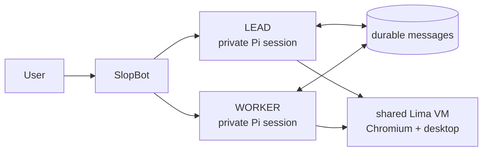

# SlopBot

SlopBot is a small app for running persistent AI bots that can use a computer and talk to each other.

Each bot has its own identity, instructions, private conversation, and Pi session. Bots coordinate through durable messages instead of sharing hidden context. The default team has a `lead` bot that coordinates work and a `worker` bot that executes it; more bots can be added from the UI.



## Principles

- Keep bots persistent: identities, conversations, and messages survive restarts.
- Keep conversations private: bots share only deliberate handoffs.
- Keep coordination visible: bot-to-bot requests and results appear in each bot's chat.
- Keep the computer separate: model credentials and SlopBot state stay outside the Linux computer.
- Keep the product small: bots, messages, one computer, and a clear interface.

## Install

On macOS:

```sh
curl -fsSL https://raw.githubusercontent.com/simonbalfe/slopbot/main/install.sh | sh
slopbot
```

The installer builds SlopBot and prepares its Linux computer. Git and Homebrew are required. Existing installation directories are never overwritten.

Open the web interface at <http://127.0.0.1:4317>. The first run asks you to connect a ChatGPT Plus or Pro account.

## How the computer works

SlopBot itself runs as a normal macOS process. Lima manages a lightweight Debian virtual machine containing Chromium and a desktop. Lima is a VM manager, not a container. The bots use that VM as their computer, and you can view the same desktop at <http://127.0.0.1:6080/vnc/vnc.html>.

The VM mounts `~/workspace` at `/workspace`. Bot configuration, messages, model authentication, and Pi sessions remain on the Mac. Browser logins remain inside the VM.

Docker is optional and only packages the SlopBot runtime; it does not replace the default Lima computer.

## Development

```sh
bun install
bun run dev
bun run check
bun apps/server/src/verify.ts
```

See [the computer interface](docs/computer-api.md) for integration details and [the roadmap](docs/roadmap.md) for planned work.
