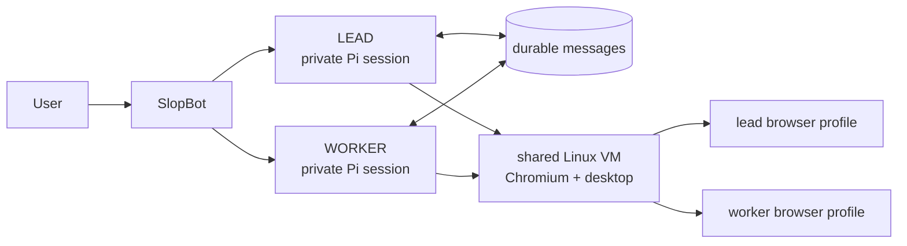

# SlopBot

SlopBot is a small app for running persistent AI bots that can use a computer and talk to each other.

Each bot has its own identity, instructions, private conversation, and Pi session. Bots coordinate through durable messages, keeping every handoff deliberate and visible. The default team has a `lead` bot that coordinates work and a `worker` bot that executes it; more bots can be added from the UI.



## Principles

- Keep bots persistent: identities, conversations, and messages survive restarts.
- Keep conversations private: bots share only deliberate handoffs.
- Keep coordination visible: bot-to-bot requests and results appear in each bot's chat.
- Keep the user in control: active work can be redirected or stopped at any time.
- Keep the computer separate: model credentials and SlopBot state stay outside the Linux computer.
- Keep the product small: bots, messages, one computer, and a clear interface.

## Install

On macOS or Linux:

```sh
curl -fsSL https://raw.githubusercontent.com/simonbalfe/slopbot/main/install.sh | sh
slopbot
```

The installer downloads SlopBot and installs missing runtime dependencies into user-owned directories, including Bun and a pinned Lima release. It detects the operating system and CPU architecture and does not require Homebrew or Git. On Linux, it installs QEMU through the available system package manager when QEMU is missing. Existing installation directories are preserved.

Open the web interface at <http://127.0.0.1:4317>. The first run asks you to connect a ChatGPT Plus or Pro account.

## How the computer works

SlopBot runs as a native process on macOS or Linux. Lima manages a lightweight Debian virtual machine using the host's supported virtualization system. Every bot uses that same computer and keeps a separate persistent Chromium profile inside it. You can view and control the shared desktop at <http://127.0.0.1:6080/vnc/vnc.html>.

The VM mounts `~/workspace` at `/workspace` by default. Set `SLOPBOT_WORKSPACE_PATH` before installation to choose another directory. Bot configuration, messages, model authentication, and Pi sessions remain on the host. Browser logins remain inside the VM.

Docker provides optional packaging for the SlopBot runtime. Lima provides the same local Linux computer contract on macOS and Linux.

## Development

```sh
bun install
bun run dev
bun run check
bun apps/server/src/verify.ts
```

See [the computer interface](docs/computer-api.md) for integration details and [the roadmap](docs/roadmap.md) for planned work.
