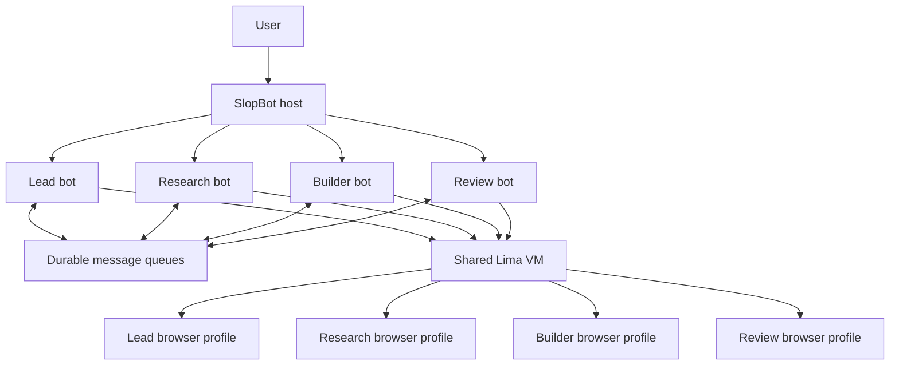

# SlopBot roadmap

SlopBot is a small multi-bot app for using a computer. Bots have persistent identities and private conversations, send deliberate messages to one another, and work through one shared Linux VM. The interface should continue to feel like chatting with a capable team, while orchestration stays in the host.

This roadmap holds the deeper implementation plan so the main README can stay focused on installing SlopBot and understanding its core ideas.

## Foundation

- [x] Multiple bots with stable IDs, profiles, and separate Pi sessions.
- [x] A default `lead` and `worker`, plus user-created bots.
- [x] Private per-bot transcripts.
- [x] Durable asynchronous bot-to-bot requests and correlated replies.
- [x] Visible delivery state, retries, and restart recovery.
- [x] One shared Linux computer with a persistent browser and desktop.
- [x] A CLI installer that provisions and manages the Lima VM.

## 1. Reliable coordination

- [x] Address messages by stable bot ID.
- [x] Return a delivery acknowledgement immediately and deliver replies as later events.
- [x] Persist queued messages and recover unfinished delivery after restart.
- [ ] Add message IDs and explicit idempotency checks across every delivery path.
- [ ] Add bounded attachments for direct bot-to-bot messages.
- [ ] Prevent automatic acknowledgement loops and cap message size.
- [ ] Show a compact handoff format: goal, state, evidence, constraints, and next action.

## 2. Runs, priority, and cancellation

- [ ] Persist runs with `user`, `agent`, `automation`, and `background` lanes.
- [ ] Always schedule an active user request above internal work.
- [ ] Let users stop, redirect, or supersede active work.
- [ ] Support priority direct messages that can supersede non-user work.
- [ ] Record which run was interrupted, why, and whether it should resume, restart, or end.
- [ ] Add priority reasons, sender rate limits, and visible audit events.
- [ ] Cancel stale work with an orchestration epoch so it cannot resume blindly.

## 3. Scoped memory

- [ ] Store bot profiles, transcripts, and durable memory separately.
- [ ] Add `profile`, `log`, and `note` memory tiers.
- [ ] Add `agent`, `user`, and `project` ownership scopes.
- [ ] Keep agent-scoped memory private by default.
- [ ] Retrieve a ranked, budgeted memory view for each turn instead of loading the full store.
- [ ] Record source and learned-at metadata for every durable fact.
- [ ] Make memory inspectable and removable from the interface.

## 4. One shared computer, separate work surfaces

- [x] Run all bots against one shared Lima Linux VM.
- [x] Share the VM filesystem, terminal environment, browser, and desktop.
- [ ] Give each bot a persistent browser profile and session inside the shared VM.
- [ ] Assign per-bot desktop windows or screens while keeping the underlying VM shared.
- [ ] Persist screen ownership and expose a separate viewer URL for each active bot.
- [ ] Queue visual work, reuse released screens, or fall back to non-visual tools when screen capacity is full.
- [ ] Add locks, ownership rules, or worktrees for bots changing the same files.
- [ ] Surface which computer, browser profile, and screen each bot is using.

## 5. Permissions and audit

- [ ] Add `always`, `ask`, and `never` standing modes, with `ask` as the default for user-machine access.
- [ ] Support allow once, deny, always allow, and never allow decisions.
- [ ] Scope approvals to the bot, tool call, action, target, run, and expiry time.
- [ ] Require exact, visible approval for external, destructive, publishing, sending, or payment actions.
- [ ] Remember denials within the current direction so bots do not keep asking.
- [ ] Add policy ceilings that standing user preferences cannot exceed.
- [ ] Record who requested, approved, and performed every consequential action.

## 6. Bounded team rooms

- [ ] Add rooms with their own transcript, purpose, membership, and orchestration epoch.
- [ ] Keep private bot conversations out of room prompts unless deliberately shared.
- [ ] Support mentions, rotating starting speakers, and `(pass)` responses.
- [ ] Start with hard limits of 6 members, 3 rounds, 10 total messages, 2 messages per bot turn, and 24 recent room messages.
- [ ] Stop when a round adds nothing, a cap is reached, or the room is superseded.
- [ ] Let a lead bot assemble one conclusion, evidence summary, and list of remaining risks.

## 7. Tools, workflows, and models

- [ ] Describe every tool with a stable name, typed input, side-effect policy, result shape, and audit event.
- [ ] Enable workflows and skills per bot.
- [ ] Import declared instruction files and helpers with their source and provenance recorded.
- [ ] Execute imported helpers only during authorized sandbox runs.
- [ ] Add scheduled routines that wake a bot through the automation lane.
- [ ] Define a provider-neutral model adapter for streaming, tool calls, usage, and cancellation.
- [ ] Allow different bots or turns to use different model providers without changing coordination state.

## Acceptance checklist

- [x] Bot A can message Bot B without waiting for B's answer.
- [x] B's reply arrives later and wakes A through a correlated message.
- [x] Restarting the host preserves queued work.
- [ ] A queued message wakes its recipient no more than once.
- [ ] Normal peer traffic waits behind active work.
- [ ] Priority peer traffic can supersede non-user work and never interrupts the active user lane.
- [ ] A room always stops within its configured bounds.
- [ ] A bot can pass without creating a visible room message.
- [ ] Private transcripts and agent-scoped memory stay private by default.
- [ ] Browser profiles remain separate while bots share the VM and filesystem.
- [ ] Scoped approvals expire correctly and `never` reliably blocks an action.
- [ ] Every consequential side effect has an authorization and audit record.

## Long-term ideas

- Reusable bot templates for common teams such as research, build, review, and operations.
- Project workspaces that bundle bots, scoped memory, shared files, and policies.
- Channels and integrations that deliver user requests into the same durable run system.
- A small plugin and skill library with explicit capabilities and per-bot enablement.
- Optional remote shared computers after the single-VM experience is dependable.
- Multiple shared computers only when scheduling, ownership, and permissions are clear in the interface.

## Product invariants

- A bot is a persistent identity, private transcript, memory view, tools, and run state around a replaceable model.
- Bots communicate through small asynchronous messages rather than merged conversation histories.
- The host owns queues, runs, permissions, rooms, memory scopes, and computer assignments.
- The active user lane has the highest priority.
- One shared VM can provide several separate browser profiles and visible work surfaces.
- Every external or destructive effect is explicitly authorized and auditable.
- Every run, room, and automation can be cancelled without hidden stale work restarting later.
- The interface presents requests, activity, and results while keeping orchestration details out of the user's way.
