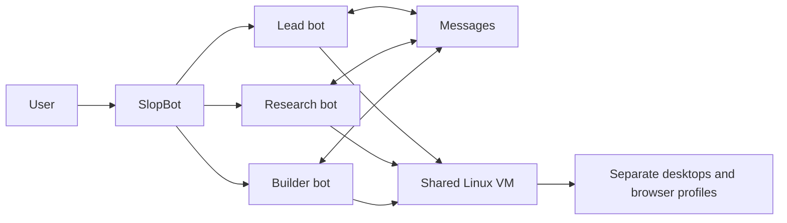

# SlopBot roadmap

## End goal

SlopBot is a simple app for running a small team of persistent AI bots.

Each bot has its own role and private conversation. Bots communicate through clear messages and use one shared Linux computer. Inside that computer, each bot keeps its own desktop, browser profile, and working session.

The user sees what the team is doing and can redirect or stop it at any time.

## Working now

- [x] Multiple persistent bots with separate identities and conversations.
- [x] Bots can send durable messages when the user asks and return replies to each other.
- [x] Messages recover after SlopBot restarts.
- [x] Every bot uses the same Linux computer and keeps a separate synchronized desktop and browser profile.
- [x] The installer sets up SlopBot and Lima on macOS and Linux.
- [x] Users can redirect or stop active bot work.

## Next

- [ ] Add small private and shared memories.
- [ ] Add scheduled routines.

## Later

- [ ] Let several bots discuss a decision together without conversations running forever.
- [ ] Add reusable bot teams for research, building, review, and operations.
- [ ] Group bots, memory, files, and permissions into projects.
- [ ] Let users choose which models, tools, and skills each bot can use.

## Product rules

- The user always has priority over internal bot work.
- Each bot keeps its own identity and private conversation.
- Bots start a handoff only when the user explicitly asks to involve a named teammate.
- All bots use one shared VM, with a separate desktop and browser session for each bot.
- SlopBot stores coordination state so work survives restarts.
- The interface stays focused on bots, their work, and their results.
